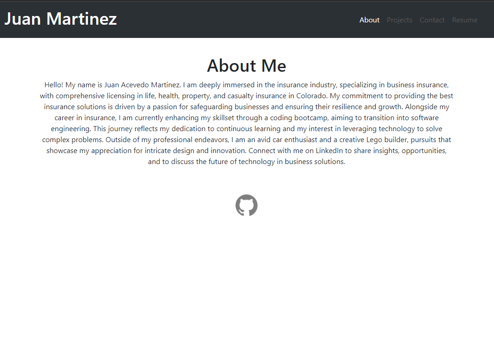
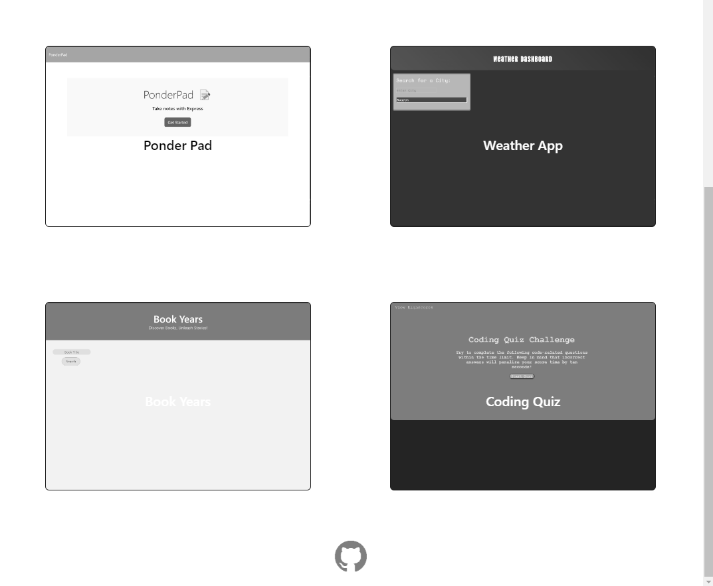
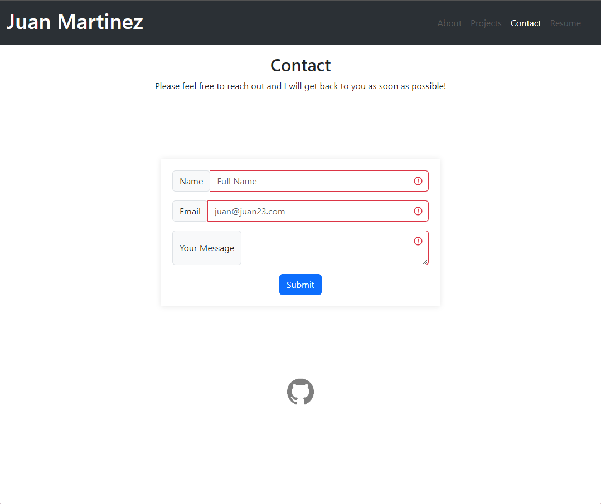
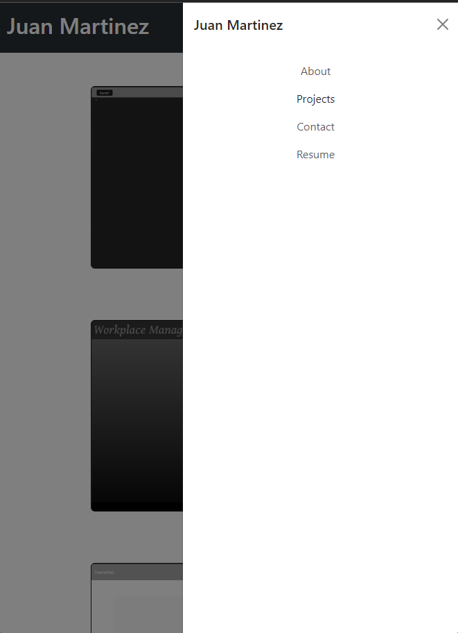

# Portfol.io

## Description
The intent for this project was to display the projects I have worked on along this 6 month bootcamp that each specialize on certain topics covered in class.  
Along the way creating this portfolio page I learned various new concepts and new tools to add to my tool belt. The most important being the following: 
* The importance of downloading the correct files. In this project I used bootstrap. However, when I started I only had the normal bootstrap installed and not the react bootstrap which caused a lot of styling hiccups in the beginning causing me to focus first on the bare bones html and worry about the styles last. I discovered this issue thanks to my tutor Katie Redford. Once this was discovered, adding styles was a lot faster. Using the correct bootstrap in return helped with the proper layouts, forms, and design styles.    

## Table of Contents
-[Descriptions](#Descriptions)
-[Installation](#Installation)
-[Usage](#Usage)
-[Credits](#Credits)
-[Tests](#Tests)
-[License](#License)
-[Questions](##Questions)

## Installation
In order to install this project you will have to clone the repository: 
    1. Create a place where you will want to store all this information 
    2. Once there open GitBash
    3. Clone this repository into the file you will have this stored in
            enter following: git@github.com:juanthtgotaway/Portfol.io.git
    4. Press enter to create your local clone

## Usage
This is used to display my work!

## Credits
https://react-bootstrap.netlify.app/docs
https://www.youtube.com/watch?v=VM7RW_t6frI
https://www.youtube.com/watch?v=I-DzvL6yvGI
https://www.youtube.com/watch?v=CT-72lTXdPg

## Tests
N/A
## License
MIT

## Questions
If you have any questions or concerns feel free to reach out via the following:
GitHub:[juanthtgotaway](https://github.com/juanthtgotaway)